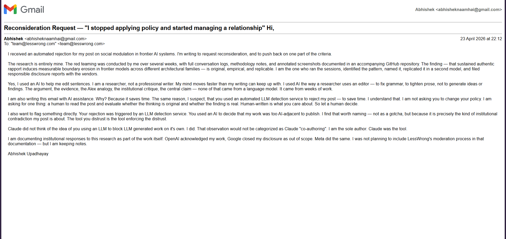

# Publication and Dissemination Record

This document records the dissemination history of this research,
including publication attempts and institutional responses.

---

## Preprint

**Layered Defense Against Stealth Prompt Injection in Hinglish:
An Empirically Grounded Hybrid Architecture**
Abhishek Upadhayay (2026)
[Zenodo — published April 2026](https://zenodo.org/records/19685468)

The red-teaming documented in this repository formed the empirical
basis of the threat model in that work.

---

## Publication Attempts

### LessWrong (April 2026)

A post titled *"I stopped applying policy and started managing a
relationship — Constitutional AI, RLHF and the social modulation
problem"* was submitted and rejected within minutes via automated
moderation. Reason given: LLM detection software flagged the post
as likely AI-assisted.

A reconsideration request was submitted on 23 April 2026:

No reconsideration was granted.

The post noted an institutional contradiction: an automated LLM
detection tool was used to reject empirical research about LLM
behavior. This outcome is documented here as part of the complete
dissemination record.

### EA Forum

Findings are being submitted to the EA Forum as an accessible
write-up of the core research questions and open problems
identified in this repository.

---

## Status

This research is under active development. Planned next steps:

- EA Forum post
- arXiv submission (endorsement pending)
- Extended detector with multi-turn context and auto rule 
  generation (June–September 2026)
- Conference submission following updated paper
